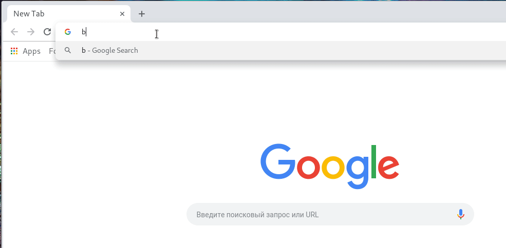

## base64-url

Visit base64-encoded URLs in Google Chrome as if they were plaintext!

This extension is currently [published in Chrome web store](https://chrome.google.com/webstore/detail/base64-url/obojpkbmegollomionmddmmcoehhogpm).

If you have problems accessing certain URL and this addon suggests you to contact author with some weird invite, roll back to version 1.1 (checkout, unpack it and load unpacked). Or
contact the author with information requested and get an update.
